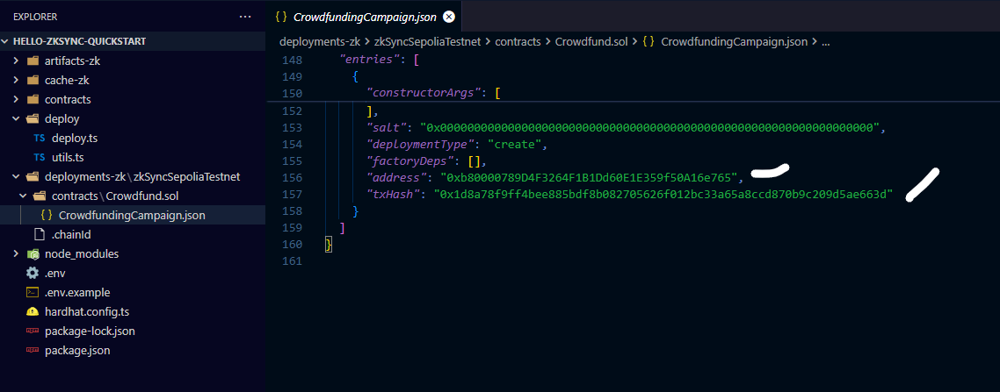

# HOW TO CREATE CROWDFUNDING DAPP USING zkSYNC PRE WRITTEN SMART CONTRACT

## TABLE OF CONTENTS

1. [Introduction](#introduction)

2. [How to install zkSync](#how-to-install-zksync)

3. [How to compile the smart contract](#how-to-compile-the-smart-contract)

4. [How to deploy the smart contract on zkSYNC](#how-to-deploy-the-smart-contract-on-zksync)

5. [How to create the application UI](#how-to-create-the-application-ui)

6. [How to integrate the smart contract with frontend](#how-to-integrate-the-smart-contract-with-frontend)

### Prerequisites

1. You have must have knowledge in React.js or any other js framework or library

2. You have must have a Code editor installed such as VScode

### Technologies needed

1. Node.js

2. Ether.js

3. React.js or any other JavaScript framework or library

4. Metamask wallet

5. Private key

6. [zkSync sepolia faucet](https://docs.zksync.io/build/zksync-101#fund-your-wallet)

7. TailwindCSS or any other CSS framework or library for styling purposes

## Introduction

zkSync Era is a ZK rollup, a trustless protocol that uses cryptographic validity proofs to provide scalable and low-cost transactions on Ethereum. In zkSync Era, computation is performed off-chain and most data is stored off-chain as well. As all transactions are proven on the Ethereum mainchain, users enjoy the same security level as in Ethereum. [Learn More](https://ileolami.hashnode.dev/deep-dive-into-zksync-protocol#heading-an-overview-of-zksync)

## How to install zkSync

```shell
npx zksync-cli@latest create --template qs-hello-zksync hello-zksync-quickstart
cd hello-zksync-quickstart
```

For Foundry, run this command in your terminal:

```shell
npx zksync-cli@latest create --template qs-fs-hello-zksync hello-zksync-foundry-quickstart
cd hello-zksync-foundry-quickstart
```

You will be asked to input your private key, grab the private key from your account and input it

Use this video as a guide:
[Watch the video](https://go.screenpal.com/watch/cZ1DFNVNdQI)

After a Successful installation, you will see the following file:


## How to compile the smart contract

To deploy the smart contract, run the following command:

For npm:

```shell
npm run compile
```

for yarn:

```shell
yarn compile
```

for pnpm:

```shell
pnpm run compile
```

for bun:

```shell
bun run compile
```

Use this video as guide:
[watch this video](https://go.screenpal.com/watch/cZ1DqsVNdI2)

After compilation, you see additional folder like this:


## How to deploy the smart contract on zkSYNC

In order to deploy the smart contract, you will need to deploy with script using the `deploy.ts` file uder the deploy folder. Run the following command:

For npm:

```shell
npx hardhat deploy-zksync --script deploy.ts
```

for yarn:

```shell
yarn hardhat deploy-zksync --script deploy.ts
```

for pnpm:

```shell
pnpm exec hardhat deploy-zksync --script deploy.ts
```

for bun:

```shell
bun run hardhat deploy-zksync --script deploy.ts
```

 The deploy keyword will trigger the `deploy` script command on `package.json`

Use this video as a guide: [watch this video](https://go.screenpal.com/watch/cZ1DY2VNd2g)

Upon successful deployment, you will get an output containing the contract address, source, and encoded constructor arguments as show below.


You can also get the contract address from the `CrowdfundingCampaign.json` under `Contract` folder as shown below.



## How to create the application UI

## How to integrate the smart contract with frontend
