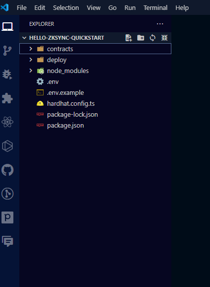
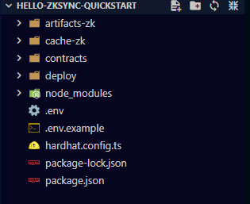
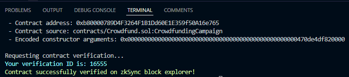

# HOW TO CREATE CROWDFUNDING DAPP USING zkSYNC PRE WRITTEN SMART CONTRACT

## TABLE OF CONTENTS

1. [Introduction](#introduction)

2. [How to install zkSync](#how-to-install-zksync)

3. [How to compile the smart contract](#how-to-compile-the-smart-contract)

4. [How to deploy the smart contract on zkSYNC](#how-to-deploy-the-smart-contract-on-zksync)

5. [How to create Connect Wallet](#how-to-create-connect-wallet)

6. [How to create the application UI](#how-to-create-the-application-ui)

7. [How to integrate the smart contract with frontend](#how-to-integrate-the-smart-contract-with-frontend)

### Prerequisites

1. You have must have knowledge in React.js or any other js framework or library

2. You have must have a Code editor installed such as VScode

### Technologies needed

1. Node.js

2. Ether.js

3. React.js or any other JavaScript framework or library

4. Metamask wallet

5. Private key

6. [zkSync sepolia faucet](https://docs.zksync.io/build/zksync-101#fund-your-wallet)

7. TailwindCSS or any other CSS framework or library for styling purposes

8. [Thirdweb Connect SDK](https://portal.thirdweb.com/connect/sign-in/ConnectButton)

## Introduction

zkSync Era is a ZK rollup, a trustless protocol that uses cryptographic validity proofs to provide scalable and low-cost transactions on Ethereum. In zkSync Era, computation is performed off-chain and most data is stored off-chain as well. As all transactions are proven on the Ethereum mainchain, users enjoy the same security level as in Ethereum.
[Read More](https://ileolami.hashnode.dev/deep-dive-into-zksync-protocol)

## How to install zkSync

```shell
npx zksync-cli@latest create --template qs-hello-zksync hello-zksync-quickstart
cd hello-zksync-quickstart
```

For Foundry, run this command in your terminal:

```shell
npx zksync-cli@latest create --template qs-fs-hello-zksync hello-zksync-foundry-quickstart
cd hello-zksync-foundry-quickstart
```

You will be asked to input your private key, grab the private key from your account and input it

Use this video as a guide:
[Watch the video](https://go.screenpal.com/watch/cZ1DFNVNdQI)

After a Successful installation, you will see the following file:



## How to compile the smart contract

To deploy the smart contract, run the following command:

For npm:

```shell
npm run compile
```

for yarn:

```shell
yarn compile
```

for pnpm:

```shell
pnpm run compile
```

for bun:

```shell
bun run compile
```

Use this video as guide:
[watch this video](https://go.screenpal.com/watch/cZ1DqsVNdI2)

After compilation, you see additional folder like this:



## How to deploy the smart contract on zkSYNC

In order to deploy the smart contract, you will need to deploy with script using the `deploy.ts` file uder the deploy folder. Run the following command:

For npm:

```shell
npx hardhat deploy-zksync --script deploy.ts
```

for yarn:

```shell
yarn hardhat deploy-zksync --script deploy.ts
```

for pnpm:

```shell
pnpm exec hardhat deploy-zksync --script deploy.ts
```

for bun:

```shell
bun run hardhat deploy-zksync --script deploy.ts
```

The deploy keyword will trigger the `deploy` script command on `package.json`

Use this video as a guide: [watch this video](https://go.screenpal.com/watch/cZ1DY2VNd2g)

Upon successful deployment, you will get an output containing the contract address, source, and encoded constructor arguments as show below.



You can also get the contract address from the `CrowdfundingCampaign.json` under `Contract` folder as shown below.

(Media/address-json.png)


## How to create the application UI

In order to make your file more organised, create a new folder and move all the files and folder into the new folder you just created.
Check out the image below to see how:

(Media/backendfolder.png)

1. Install the any Js framework or library you want to use(I will be using [Vite.js and React.js](https://ileolami.hashnode.dev/a-beginner-guide-on-how-to-install-and-use-vitejs))

2. Install the any CSS framework or library you want to use(I will be using [TailwindCSS](https://tailwindcss.com/docs/installation/framework-guides))

3. Clear out the existing from the `App.jsx` file and add the following to your:

```shell
<main className="min-h-screen bg-gradient-to-r from-green-400 to-blue-500 p-10">
        <div className='flex justify-between'>
          <p className=' text-lg p-5 h-16 w-62 bg-neutral-100 text-center rounded-2xl shadow-2xl'>Funding Goal:<span className="font-bold text-red-500">0</span> </p>
        </div>
      <Modal isOpen={isModalOpen} setIsOpen={setIsModalOpen} title={title} Message={Message} />
      <div className='flex items-center justify-center'>
      <div className="bg-white p-8 rounded-lg shadow-2xl w-96">
        <h1 className="text-3xl mb-6 text-center text-blue-500">Crowdfund Contract</h1>
        <p className="text-xl mb-6 text-center">Total Funds Raised: <span className="font-bold text-green-500">0</span> Ether</p>
        <div className="mb-6">
          <label className="block mb-2 text-gray-700">Contribution Amount</label>
          <input 
          type="number" 
          className="border-2 border-blue-500 rounded px-3 py-2 w-full outline-none" 
          placeholder="Enter amount in Ether" 
          />
        </div>
        <div className="flex justify-between">
          <button 
          className="bg-blue-500 hover:bg-blue-700 text-white px-4 py-2 rounded">Contribute</button>
          <button 
          className="bg-red-500 hover:bg-red-700 text-white px-4 py-2 rounded">Withdraw Funds</button>
        </div>
      </div>
    </div>
    </main>
```

Note: The CSS has already been added.

### How to create Connect Wallet

As earlier mentioned, for this article will you have to use a thirdweb SDK to create a connect wallet. If you choose to another SDK, you can skip this step.

1. Install the thirdweb SDK by running the following command:

```shell
npm install thirdweb
```

## How to integrate the smart contract with frontend
